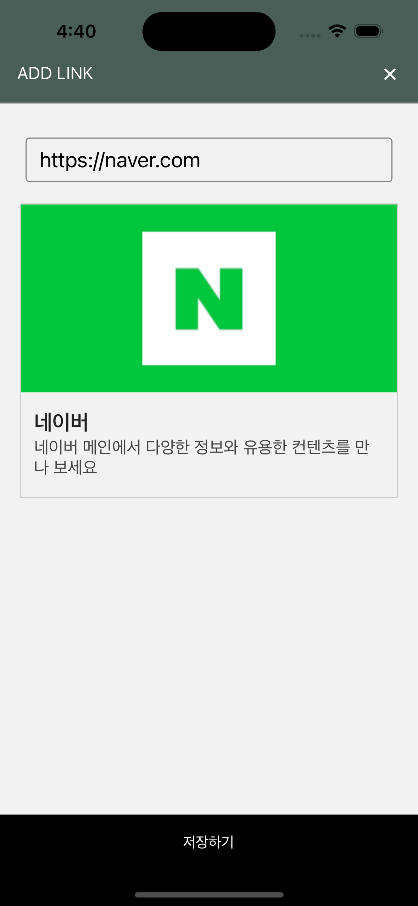

## ReactNative - 웹페이지 스크랩 앱 만들기

### 작업내용

- 리스트, 등록화면 UI 개발
- 입력한 URL에 대한 WebView 표출
- 오픈그래프 정보 가져오기
- 클립보드 기능 구현

### 기술스택

ReactNative(expo), JavaScript,  
@react-navigation/native, react-native-safe-area-context, react-native-screens,
recoil,
react-native-webview,  
@react-native-async-storage/async-storage
react-native-opengraph-kit, expo-clipboard
